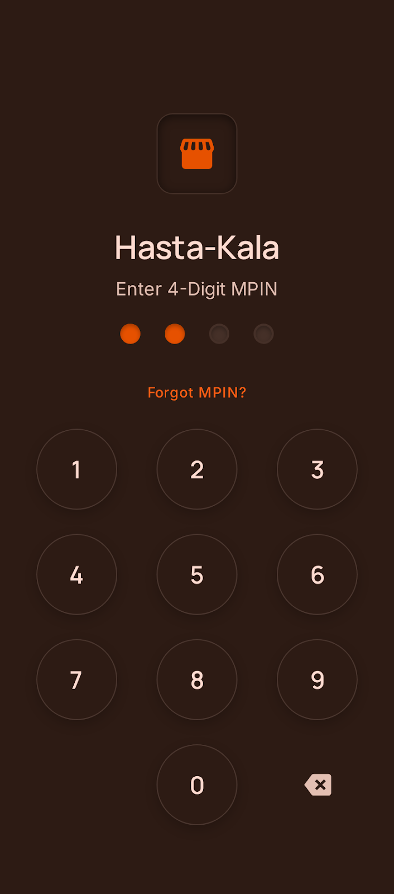
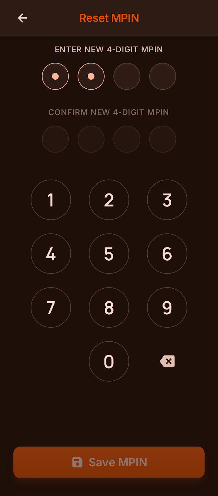
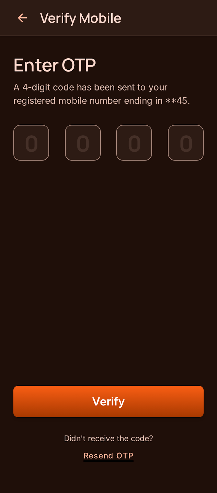
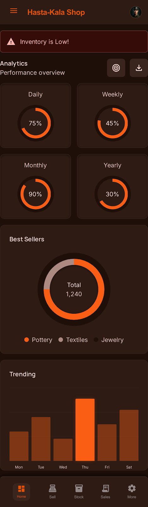
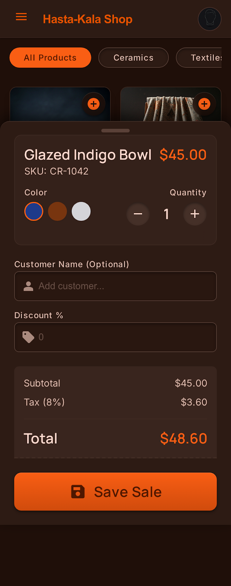
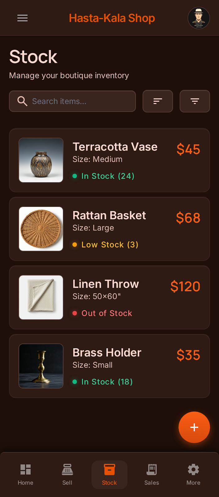
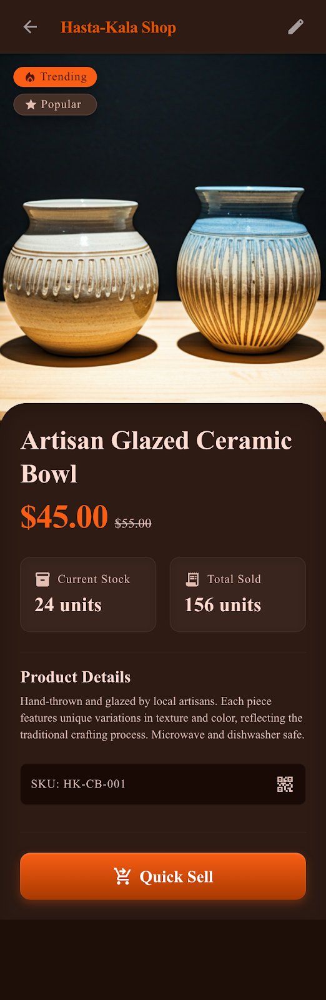
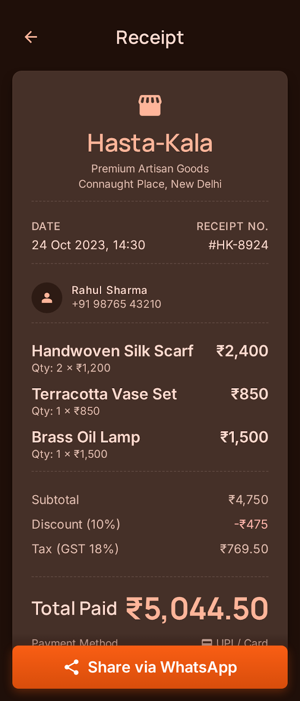
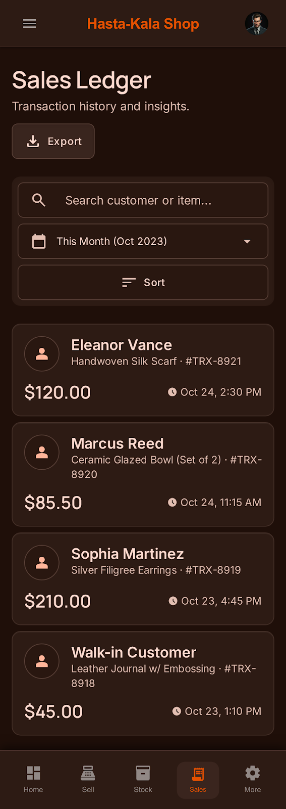
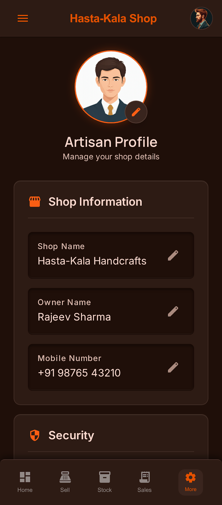

# Hasta-Kala (Artisanal Heritage POS)

> A pixel-perfect Android POS app empowering rural artisans to digitize sales, track inventory, and discover best-selling products — fully offline.


---

## 🧩 Problem Statement

Rural artisans — makers of pottery, textiles, and handcrafts — have no visibility into which products sell best. They rely on manual ledgers, leading to dead stock and wasted effort. **Hasta-Kala** solves this by turning every sale into a data point that drives smarter production decisions, giving rural creators the same analytical power as modern retail businesses.

---

## 🎨 Design System: Artisanal Heritage

The application follows the **Artisanal Heritage** design system, which bridges the gap between traditional craftsmanship and modern digital efficiency. It features:

- **Espresso Brown & Saffron Orange Palette**: Warm, sophisticated, and high-contrast.
- **Premium Typography**: Manrope for headlines and Inter for legibility.
- **Tactile UI**: Subtle inner shadows and layered surfaces that mimic physical materials.
- **Glassmorphism Effects**: Large touch targets ensuring accessibility for non-digital-native users.
- **Three-Tap Rule**: Any core action (log a sale, check stock, view best seller) is completed within 3 taps.

---

## 🚀 Features

- 🔐 **Secure Authentication** — MPIN-based login and setup with OTP verification.
- 📊 **Real-time Analytics** — Visualized sales data, income/expense tracking via MPAndroidChart.
- 🛒 **Efficient POS** — Quick sell interface with itemized receipt generation.
- 📦 **Inventory Management** — Comprehensive product tracking with photo support.
- 📴 **Offline First** — Built with Room Database for seamless local data management.
- 🏆 **Best Seller Dashboard** — Pie chart auto-updates after each sale showing top products.
- ⚠️ **Stock Alerts** — Threshold-based alerts when stock falls below minimum.
- 📅 **Income Log** — Weekly and monthly income views with filtering capability.
- 🔍 **Sales Ledger** — Full transaction history with search and sort functionality.

---

## 📸 Screenshots 

Below are the app's UI:

| Screen |
| :--- | :--- |
| **MPIN Login** |  |
| **Set New MPIN** |  |
| **OTP Verification** |  |
| **Dashboard & Analytics** |  |
| **POS Quick Sell** |  |
| **Manage Inventory** |  |
| **Product Detail** |  |
| **Bill Detail** |  |
| **History of Sales** |  |
| **Profile Settings** |  |

---

## 🛠️ Tech Stack

| Layer | Technology |
|-------|-----------|
| Language | Kotlin |
| UI Framework | Jetpack Compose + Material3 |
| Architecture | MVVM (Model-View-ViewModel) |
| Navigation | Compose Navigation |
| Local Database | Room Database |
| Preferences | DataStore Preferences |
| Analytics Charts | MPAndroidChart |
| Authentication | MPIN + OTP |
| Design Blueprints | Stitch V2 |
| Min SDK | Android 10 (API 29) |
| Target SDK | Android 14 (API 34) |

---

## 📁 Folder Structure

```
Hasta_Kala/
├── app/
│   └── src/
│       └── main/
│           ├── java/com/hastakala/app/
│           │   ├── data/
│           │   │   ├── db/            # Room Database
│           │   │   ├── dao/           # Data Access Objects
│           │   │   ├── entity/        # DB Entities (Sale, Product, Profile)
│           │   │   └── repository/    # Data Repositories
│           │   ├── ui/
│           │   │   ├── screens/       # Composable Screens
│           │   │   ├── components/    # Reusable UI Components
│           │   │   └── theme/         # Artisanal Heritage Design System
│           │   ├── viewmodel/         # ViewModels (MVVM)
│           │   └── navigation/        # Nav Graph & Routes
│           └── res/
│               ├── drawable/          # Icons & Vector Assets
│               └── values/            # Colors, Strings, Themes
├── Stitch_Screens/                    # UI Design Blueprints
│   ├── mpin_login/
│   ├── dashboard_analytics/
│   ├── pos_quick_sell/
│   ├── manage_inventory/
│   └── ...
├── build.gradle.kts
├── settings.gradle.kts
├── gradle.properties
└── README.md
```

---

## 📥 Installation & Setup

### Prerequisites

- Android Studio Hedgehog or later
- Android SDK 33+
- Gradle 8.0+
- JDK 17+

### Steps to Run

1. **Clone the Repository**:
   ```bash
   git clone https://github.com/huzefamaniyar/Hasta_Kala.git
   cd Hasta_Kala
   ```

2. **Open in Android Studio**:
   Select the `Hasta_Kala` folder and wait for the Gradle sync to complete.

3. **Configure Local Properties**:
   Ensure `local.properties` has the correct `sdk.dir` path:
   ```
   sdk.dir=/Users/YourName/Library/Android/sdk
   ```

4. **Build and Run**:
   Click the **Run** button or use `Shift + F10` to deploy to an emulator or physical device.

5. **Or build APK directly**:
   ```bash
   ./gradlew assembleDebug
   ```
   APK will be generated at `app/build/outputs/apk/debug/app-debug.apk`

---

## 🏗️ Architecture Overview

```
UI Layer (Jetpack Compose)
        ↕ observes state
ViewModel Layer (StateFlow / LiveData)
        ↕ fetches/updates data
Repository Layer
        ↕
Room Database (local offline storage)
```

The app follows **MVVM** with a clean separation of concerns:
- **UI Layer**: Composable screens observe ViewModel state reactively.
- **ViewModel Layer**: Holds business logic, data transformation, and UI state.
- **Data Layer**: Room DAOs handle all database read/write operations.

---

## 🔮 Future Improvements

- ☁️ Cloud sync for data backup across devices
- 🌐 Multilingual support (Kannada, Hindi, Marathi)
- 🤖 AI-driven sales forecasting using historical data
- 💳 UPI / Razorpay payment gateway integration
- 📦 Bulk inventory import via CSV
- 🖨️ Bluetooth thermal printer support for receipts
- 📱 Tablet-optimized layout

---

## 👨‍💻 Developer

**Mohmedhuzefa Maniyar** (2KA23IS402)
B.E. Information Science & Engineering
SKSVMACET, Lakshmeshwar — VTU Affiliated

Internship at **MindMatrix.io** (CL Infotech Pvt. Ltd.), Bangalore — 2025–26
> Project 14 of the Android App Development using GenAI internship program.

---

*Developed with ❤️ for the Artisanal Community.*
